# wiki

### 介绍
* 采用前后端分离的模式，微服务版本前端(基于 [vue-element-admin](https://github.com/PanJiaChen/vue-element-admin));
* 后端采用Spring Boot、Spring Cloud & Alibaba;
* 注册中心+配置中心选型Nacos;
* 权限认证使用spring security + Jwt token;
### 软件架构
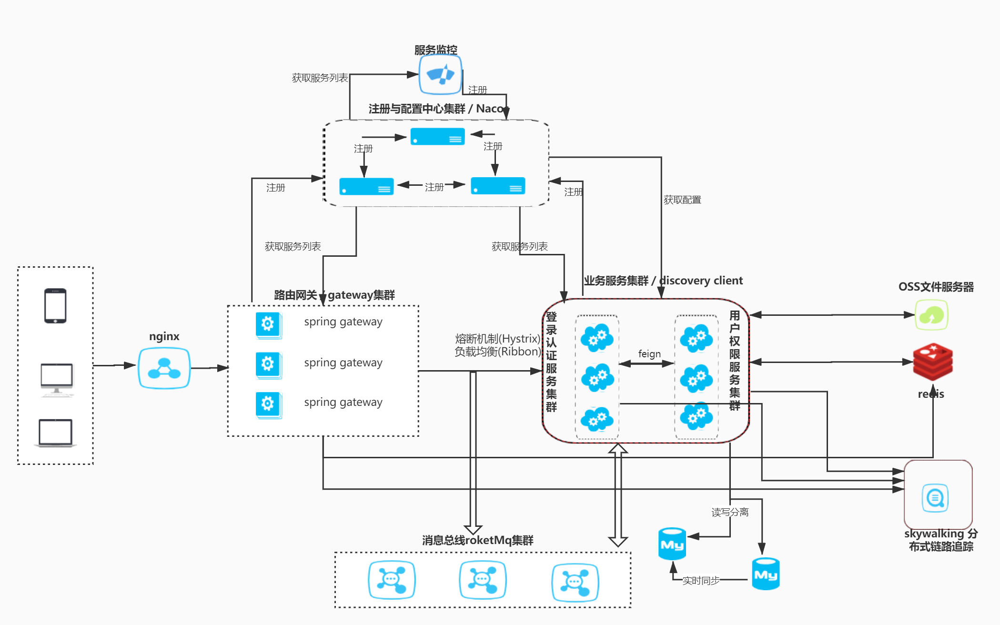

### 微服务说明

[ch-admin3](https://gitee.com/ch-cloud/ch-admin3)  
说明：静态页面（基于Vue + element-ui） 
~~~
基本功能：
——系统管理
————用户管理
————角色管理
————权限管理
————组织管理
————职位管理
————数据字据
——日志管理
————登录日志
————操作日志
扩展功能：
——Canal管理
————集群管理
————服务管理
————实例管理
————告警管理
——Kafka管理
————群集管理
————主题管理
————消息搜索
————RPC泛化调用
~~~
[ch-upms](https://gitee.com/ch-cloud/ch-upms)  
说明：用户权限管理服务  
提供用户、角色、权限、组织、职位、数据字典、日志等管理RestFul接口

[ch-sso](https://gitee.com/ch-cloud/ch-sso)  
说明：用户登录认证服务  
提供用户登录、用户信息、Token刷新、网关权限认证RestFul接口

[ch-gateway](https://gitee.com/ch-cloud/ch-gateway)  
说明：网关服务  
提供Token鉴权、请求拦截与分发、日志记录

**由于资源不足，未能提供演示环境，请参考以下安装教程**

### 安装教程
准备一台4核8G服务器  
基于Docker安装开发环境  

>基础服务
1.  安装数据库Mysql
2.  安装缓存Redis
3.  安装Nacos
4.  安装prometheus(监控中间件，非必要安装)
5.  安装grafana(监控面板，非必要安装)  

    - 复制docker/base目录到服务器
    - 切换到该目录  
    - 使用docker/base/docker-compose.yaml一键部署
```shell script
docker-compose -f docker-compose.yml up -d
```
启动完成拓扑图如下：
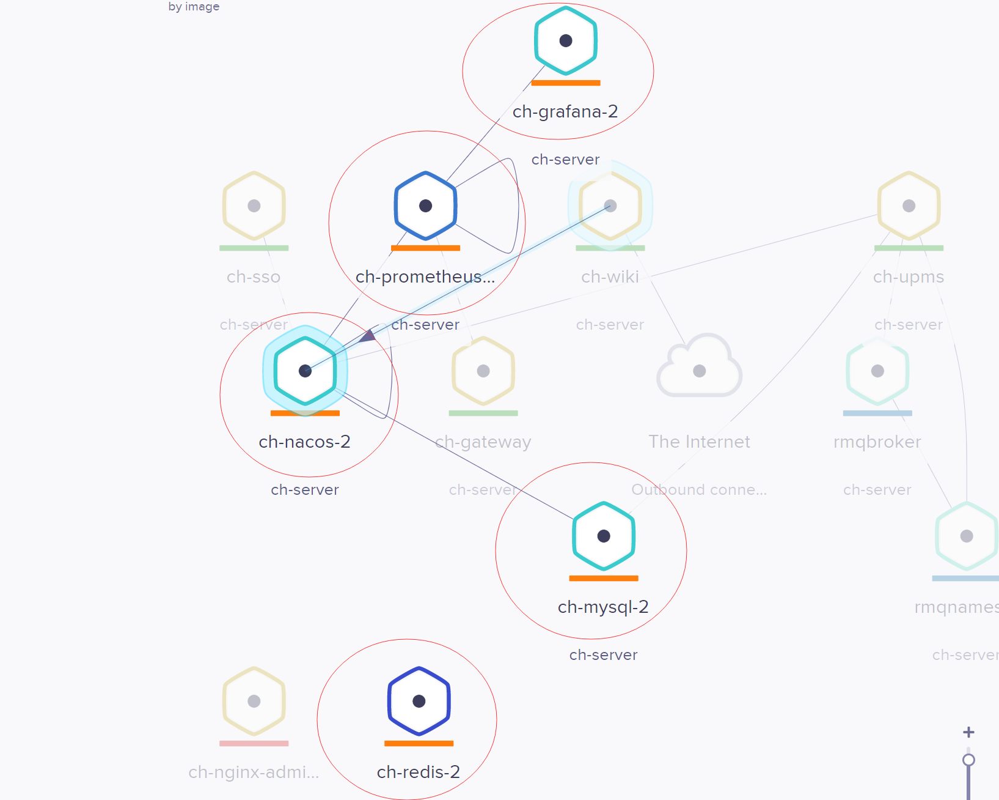
>中间服务
1.  安装RocketMQ  
    - 复制docker/RocketMQ到服务器  
    - 切换到该目录  
    - 使用docker/RocketMQ /docker-compose.yaml一键部署
```shell script
docker-compose -f docker-compose.yml up -d
```
启动完成拓扑图如下：
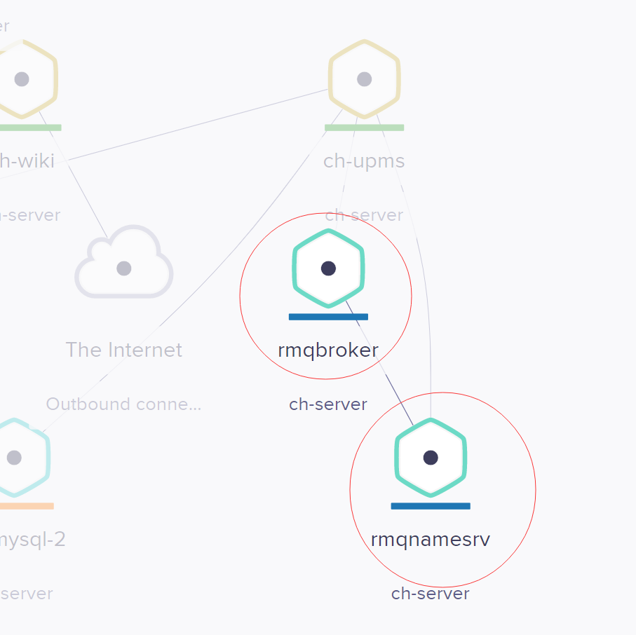
>应用服务
1.  静态页面服务（[请点击打开ch-admin3](https://gitee.com/ch-cloud/ch-admin3)）
2.  用户权限服务（[请点击打开ch-upms](https://gitee.com/ch-cloud/ch-upms)）
3.  用户登录认证服务（[请点击打开ch-sso](https://gitee.com/ch-cloud/ch-sso)）
4.  网关鉴权请求服务（[请点击打开ch-gateway](https://gitee.com/ch-cloud/ch-gateway)）
>扩展服务(非必要安装)
1.  Canal管理服务（[请点击打开canal-admin](https://gitee.com/ch-cloud/canal-admin)）
2.  Kafka管理服务（[请点击打开ch-kafka](https://gitee.com/ch-cloud/ch-kafka)）

### 使用说明
<table>
    <tr>
        <td>登录</td>
        <td>首页</td>
    </tr>
    <tr>
        <td>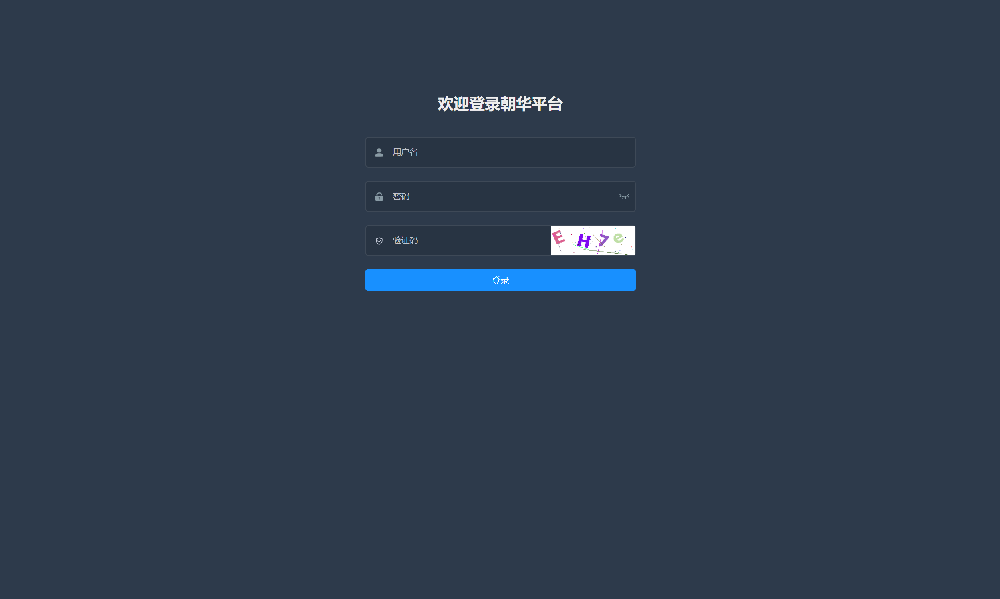</td>
        <td>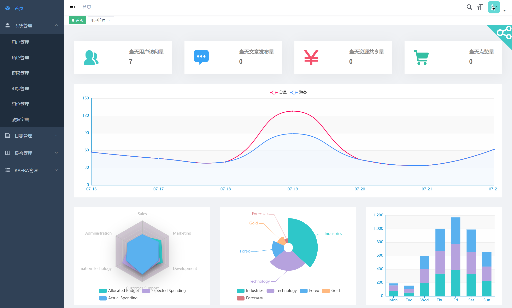</td>
    </tr>
    <tr>
        <td>用户管理</td>
        <td>角色管理</td>
    </tr>
    <tr>
        <td>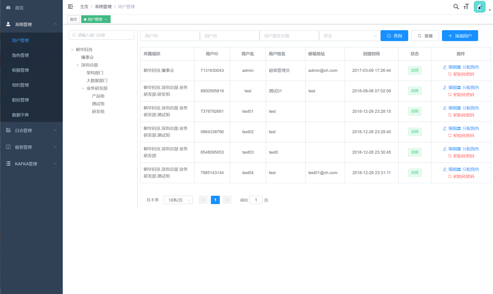</td>
        <td>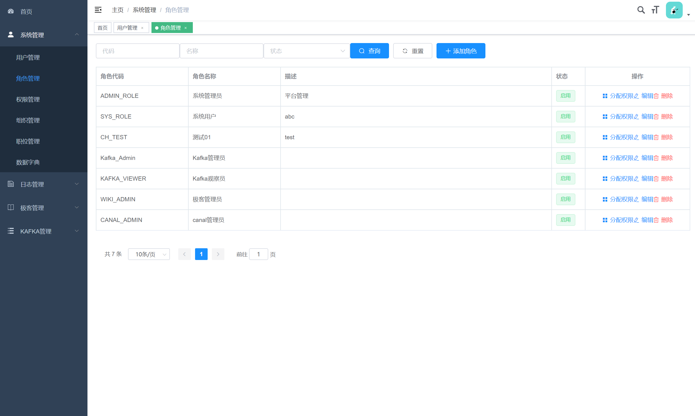</td>
    </tr>
    <tr>
        <td>权限管理</td>
        <td>组织管理</td>
    </tr>
    <tr>
        <td>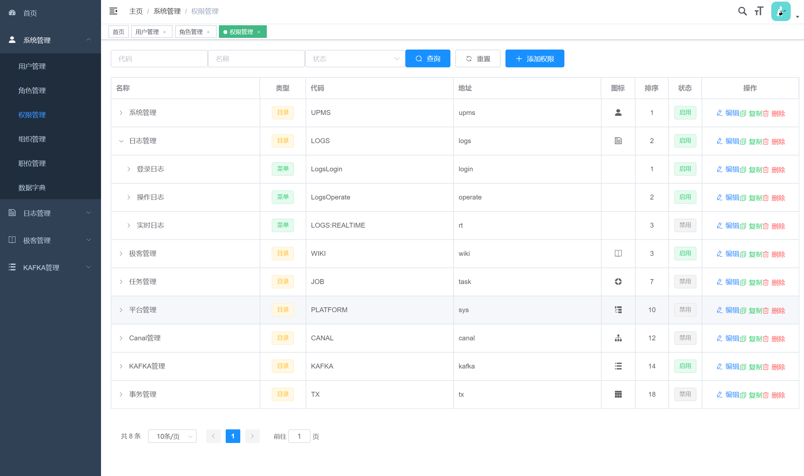</td>
        <td>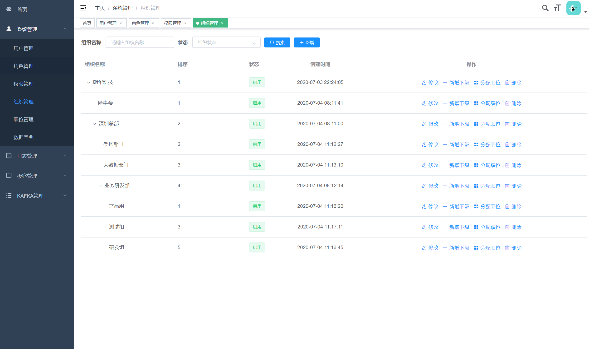</td>
    </tr>
    <tr>
        <td>职位管理</td>
        <td>数据字典</td>
    </tr>
	<tr>
        <td>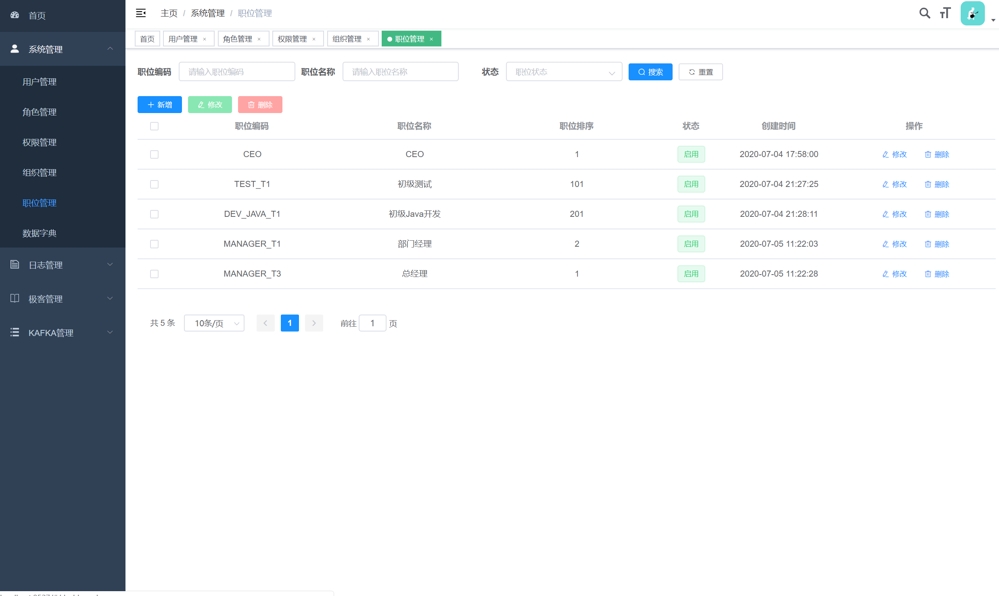</td>
        <td>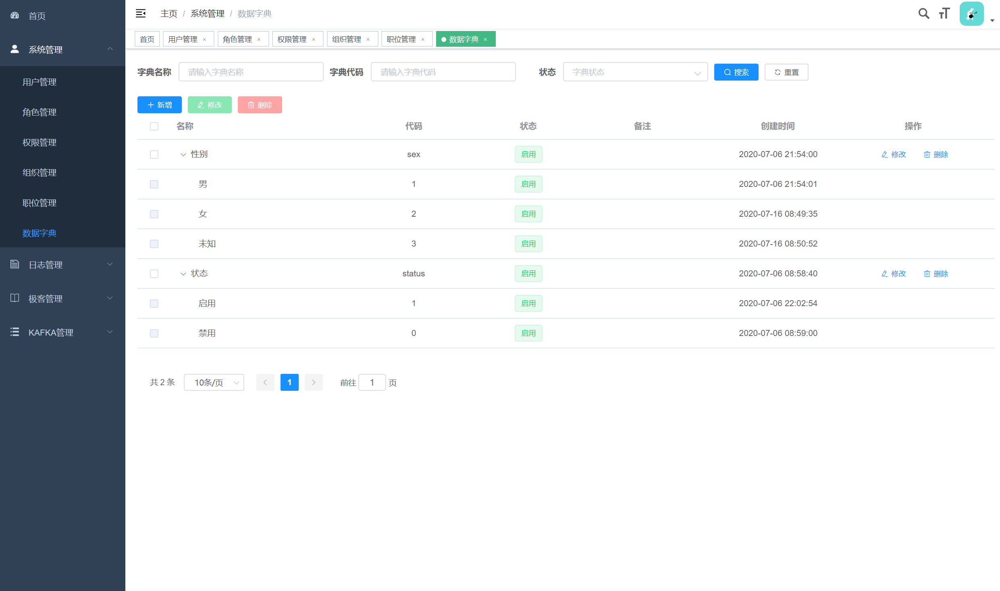</td>
    </tr>	
    <tr>
        <td>登录日志</td>
        <td>操作日志</td>
    </tr> 
    <tr>
        <td>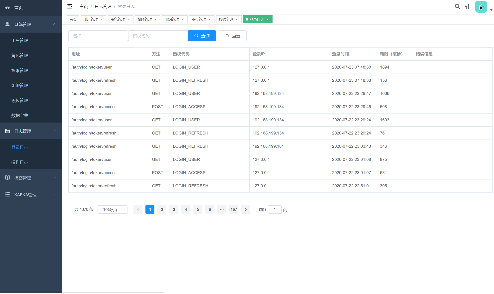</td>
        <td>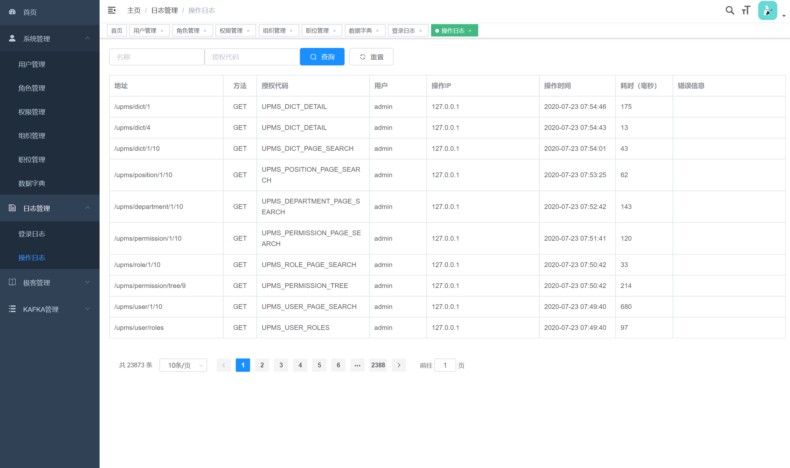</td>
    </tr>
</table>

### 参与贡献

1.  Fork 本仓库
2.  新建 Feat_xxx 分支
3.  提交代码
4.  新建 Pull Request

